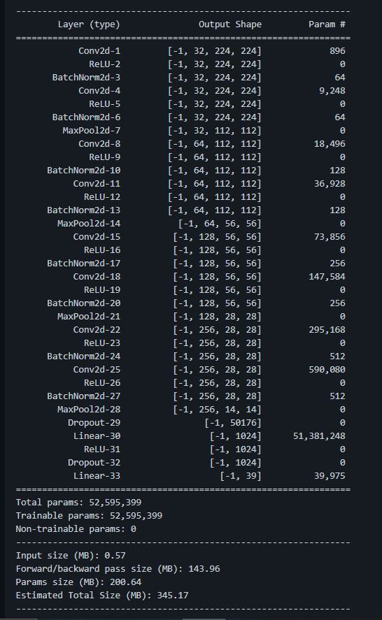

# 🧠 Convolutional Neural Network (CNN) Architecture & Training

  

## 📌 Model Specifications
- **Input Dimensions**: `3 x 224 x 224` (RGB Folio Images)
- **Architecture**: 8-Layer Deep Convolutional Neural Network with Batch Normalization & Dropout
- **Output Classes**: 39 (38 foliar pathology conditions + 1 background non-leaf class)
- **Framework**: PyTorch 2.0+

## 📁 Included Training Resources
- `Plant Disease Detection Code.ipynb`: Jupyter notebook containing full data loading, augmentation, and training loop.
- `Plant Disease Detection Code.md`: Markdown export of the training pipeline.
- `Plant Disease Detection-code.pdf`: Formatted PDF reference of the experimental notebook.
